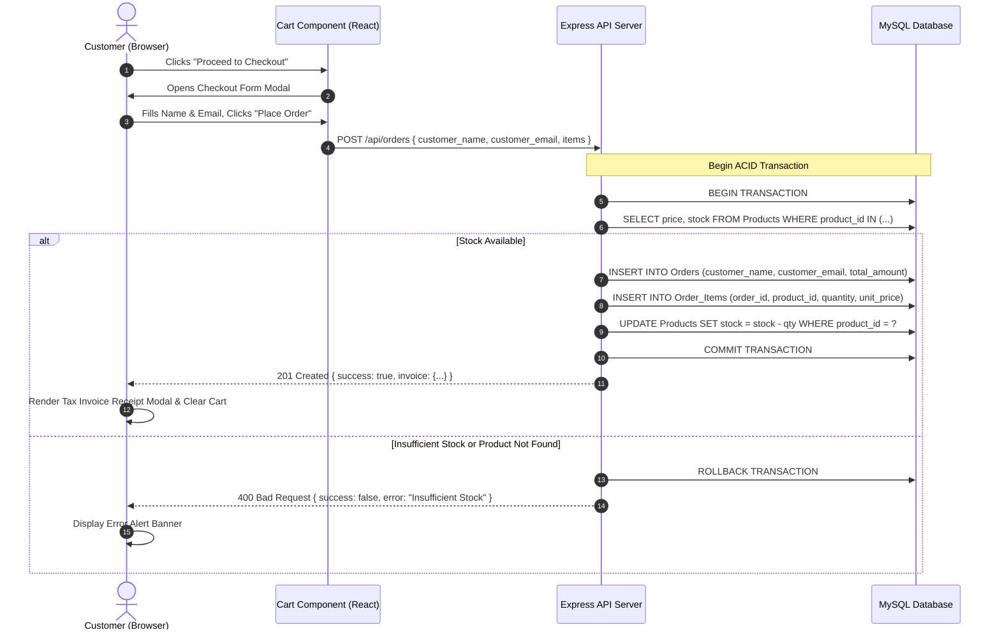
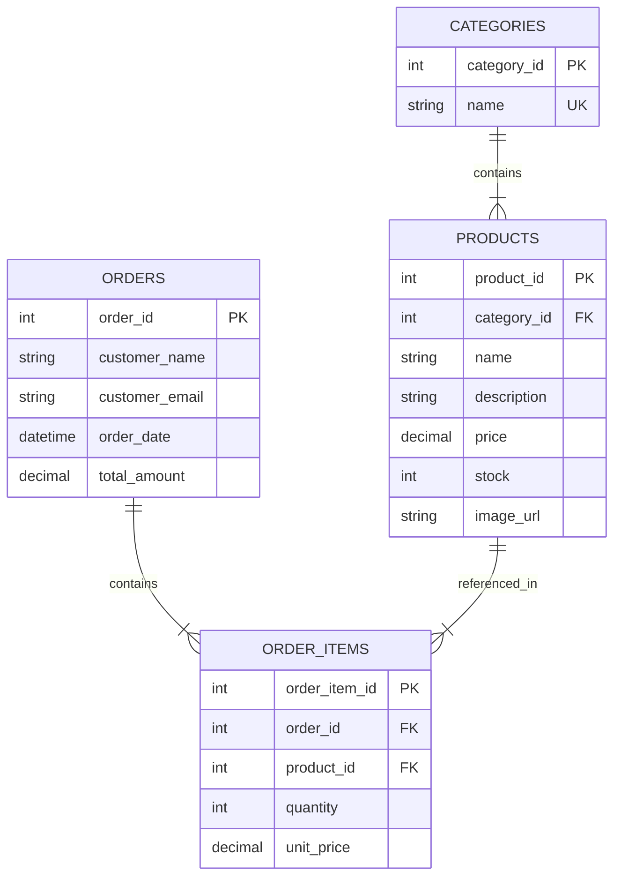

# 🛒 Aura Store — Simple E-Commerce Cart & Order Management System

<p align="center">
  
</p>

<p align="center">
  <strong>A Production-Grade 3-Tier E-Commerce Platform built with React, Express.js, and MySQL.</strong>
</p>

<p align="center">
  
  
  
  
  
  
  
</p>

---

## 📋 Table of Contents

- [1. Executive Summary & Overview](#1-executive-summary--overview)
- [2. Problem Statement](#2-problem-statement)
- [3. Vision & Objectives](#3-vision--objectives)
- [4. Key Features](#4-key-features)
- [5. Target Users & Use Cases](#5-target-users--use-cases)
- [6. Business Value](#6-business-value)
- [7. Complete System Architecture](#7-complete-system-architecture)
  - [7.1 High-Level 3-Tier Architecture](#71-high-level-3-tier-architecture)
  - [7.2 Data Flow & Sequence Diagram](#72-data-flow--sequence-diagram)
  - [7.3 Relational Entity-Relationship (ER) Diagram](#73-relational-entity-relationship-er-diagram)
- [8. Technology Stack](#8-technology-stack)
- [9. Project Folder Structure & File Manifest](#9-project-folder-structure--file-manifest)
- [10. Frontend Architecture](#10-frontend-architecture)
- [11. Backend Architecture & REST API Reference](#11-backend-architecture--rest-api-reference)
- [12. Database Architecture & SQL Analytics](#12-database-architecture--sql-analytics)
- [13. Authentication & Owner Access Control](#13-authentication--owner-access-control)
- [14. Price Integrity & Historical Billing Strategy](#14-price-integrity--historical-billing-strategy)
- [15. Development Prerequisites & Environment Setup](#15-development-prerequisites--environment-setup)
- [16. Installation Guide](#16-installation-guide)
  - [16.1 Database Provisioning (MySQL & PowerShell)](#161-database-provisioning-mysql--powershell)
  - [16.2 Backend Installation](#162-backend-installation)
  - [16.3 Frontend Installation](#163-frontend-installation)
- [17. Environment Variables (`.env`) Reference](#17-environment-variables-env-reference)
- [18. Running the Application](#18-running-the-application)
- [19. Build & Production Deployment](#19-build--production-deployment)
- [20. Security, Performance & Code Quality](#20-security-performance--code-quality)
- [21. Troubleshooting & FAQ](#21-troubleshooting--faq)
- [22. Roadmap & Known Limitations](#22-roadmap--known-limitations)
- [23. License & Contact Information](#23-license--contact-information)

---

## 1. Executive Summary & Overview

**Aura Store** is an enterprise-grade, 3-tier reference E-Commerce Cart & Order Management System. The platform allows customers to browse a curated catalog of 30 products across 5 primary categories (*Electronic Devices*, *Apparel & Clothing*, *Footwear & Shoes*, *Wearables & Accessories*, *Smart Home & Lighting*), manage a live shopping cart with dynamic tax and subtotal calculations, and complete transactional orders with instant itemized tax invoice receipt generation.

Additionally, the system features a passcode-protected **Owner Analytics Portal** accessible only to store administrators, exposing real-time business performance indicators powered by database SQL aggregate queries (`SUM`, `COUNT`, `GROUP BY`, `LEFT JOIN`).

---

## 2. Problem Statement

Traditional small-to-medium retail businesses often struggle with fragmented software solutions where inventory tracking, shopping cart states, and historical billing records exist in silos. Common challenges include:

1. **Historical Billing Corruption**: Changing a product's current catalog price inadvertently alters past customer invoices if prices are queried dynamically from the product table.
2. **Cart & Inventory Desynchronization**: Relying strictly on client-submitted prices allows malicious users to tamper with item costs during checkout.
3. **Lack of Isolated Business Intelligence**: Mixing public storefront views with confidential sales metrics exposes revenue metrics to public visitors.

**Aura Store** solves these structural challenges through ACID-compliant database transactions, server-validated pricing, immutable historical line-item recording, and role-separated admin access control.

---

## 3. Vision & Objectives

- **Transactional Reliability**: Ensure 100% data consistency during order creation using explicit database transactions.
- **Visual & UX Excellence**: Deliver a classic retail boutique interface featuring warm off-white canvas styling (`#FAF8F5`), Deep Navy (`#1B2A41`) & Gold (`#B8963E`) accents, Playfair Display serif typography, and responsive grid layouts.
- **Zero-Config Developer Onboarding**: Provide immediate local execution via dual-engine database architecture (MySQL 8.0+ production engine with SQLite automatic dev fallback).
- **Comprehensive Business Reporting**: Offer immediate executive visibility into gross sales revenue, order volumes, average order value (AOV), and category sales breakdown.

---

## 4. Key Features

- **🛍️ 30-Product Curated Catalog**: Spanning Electronic Devices, Apparel, Shoes, Wearables, and Smart Home items with pricing strictly calibrated between **₹999.00** and **₹4,999.00**.
- **🛒 Dynamic Slide-Out Cart Drawer**: Real-time quantity adjustment (`+` / `-`), item removal, live subtotal computation, estimated 5% GST/Tax calculation, and grand total tracking.
- **🔒 ACID Order Transactions**: Validates stock levels, locks product records, computes prices strictly from server database records, decrements inventory, and commits or rolls back on error.
- **🧾 Printable Tax Invoice Receipts**: Instant modal display of itemized invoices (`#INV-100X`) with zebra-striped tables, customer details, tax breakdowns, and native browser PDF print formatting (`@media print`).
- **🔐 Protected Owner Analytics Portal**: Restricted by passkey authentication (`Default PIN: 1234`), rendering real-time KPI metrics and sales breakdown charts.
- **🇮🇳 Localized INR Currency Support**: All monetary values are rendered in standard Indian Rupee format (`₹`, e.g., `₹19,999.00`).

---

## 5. Target Users & Use Cases

| Persona | Primary Needs | Key Workflows Used |
| :--- | :--- | :--- |
| **Online Shopper** | Browse items, view details, manage active cart, submit orders. | Catalog search, category filter pill navigation, drawer checkout, printable receipt. |
| **Store Owner / Manager** | Monitor revenue performance, analyze top-selling categories, inspect customer order invoices. | Owner portal passcode login, sales KPI metrics cards, category sales progress bars, invoice audit. |
| **Full-Stack Developer** | Learn or extend a clean 3-tier React + Express + MySQL codebase. | REST API integration, database schema migration, transaction handling. |

---

## 6. Business Value

- **Revenue Integrity**: Completely eliminates price tampering by rejecting client-sent prices during checkout processing.
- **Audit Compliance**: Preserves exact price snapshot (`unit_price`) on every `Order_Items` record for tax auditing and historical reconciliation.
- **Reduced Operational Overhead**: Streamlines catalog browsing, customer checkout, and invoicing into a unified web application.

---

## 7. Complete System Architecture

### 7.1 High-Level 3-Tier Architecture

```
┌─────────────────────────────────────────────────────────────────┐
│                    PRESENTATION LAYER (REACT)                   │
│  App.jsx | Header | Catalog | Cart Drawer | Checkout | Invoice  │
└────────────────────────────────┬────────────────────────────────┘
                                 │ HTTP / REST API (JSON)
┌────────────────────────────────▼────────────────────────────────┐
│                   APPLICATION LAYER (EXPRESS.JS)                │
│  routes/ | controllers/ | middleware/errorHandler | config/db   │
└────────────────────────────────┬────────────────────────────────┘
                                 │ SQL Queries & ACID Transactions
┌────────────────────────────────▼────────────────────────────────┐
│                    DATA LAYER (RDBMS ENGINE)                    │
│      MySQL 8.0+ Database (or SQLite Auto-Fallback Engine)       │
└─────────────────────────────────────────────────────────────────┘
```

### 7.2 Data Flow & Sequence Diagram



### 7.3 Relational Entity-Relationship (ER) Diagram



---

## 8. Technology Stack

### Core Technologies
- **Frontend Framework**: React 18.3.1 (Vite 8.3.4 bundler)
- **Backend Framework**: Node.js v24.18.0 & Express.js 4.19.2
- **Database Systems**: MySQL 8.0+ (Driver: `mysql2/promise`), SQLite3 5.1.7 (Auto Fallback)
- **Styling Architecture**: Vanilla CSS3 Custom Properties (CSS Variables), Google Fonts (`Playfair Display`, `Inter`)
- **Iconography**: Lucide React (`lucide-react`)

---

## 9. Project Folder Structure & File Manifest

```
E-Commerce-website/
├── database/
│   ├── schema.sql                 # DDL schema script (Categories, Products, Orders, Order_Items)
│   └── seed.sql                   # Seed script (5 Categories, 30 Products ₹999-₹4999, Initial Orders)
├── backend/
│   ├── config/
│   │   └── db.js                  # Unified MySQL connection pool & SQLite auto-fallback engine
│   ├── controllers/
│   │   ├── categoryController.js  # GET /api/categories controller logic
│   │   ├── productController.js   # GET /api/products controller logic
│   │   ├── orderController.js     # POST /api/orders & GET /api/orders/:id transactional controllers
│   │   └── reportController.js    # GET /api/reports/sales aggregate SQL report controller
│   ├── middleware/
│   │   └── errorHandler.js        # Centralized HTTP & MySQL database error handler
│   ├── routes/
│   │   ├── categoryRoutes.js      # Category endpoint routing definitions
│   │   ├── productRoutes.js       # Product endpoint routing definitions
│   │   ├── orderRoutes.js         # Order endpoint routing definitions
│   │   └── reportRoutes.js        # Sales report endpoint routing definitions
│   ├── .env                       # Environment configuration file
│   ├── .env.example               # Template environment configuration file
│   ├── package.json               # Backend Node.js dependencies manifest
│   └── server.js                  # Express API server entry point & startup runner
├── frontend/
│   ├── public/
│   │   └── images/                # Product image media assets
│   ├── src/
│   │   ├── components/
│   │   │   ├── Header.jsx          # Sticky top bar with logo, tabs, search, and cart badge
│   │   │   ├── HeroBanner.jsx      # High-impact hero section with headline & CTA scroll button
│   │   │   ├── CategoryFilter.jsx  # Category filter pills with counts & custom Lucide icons
│   │   │   ├── ProductList.jsx     # Responsive grid container with loading skeletons & empty states
│   │   │   ├── ProductCard.jsx     # Product card with image scale zoom, price, and stock status
│   │   │   ├── ProductDetailModal.jsx # Quick view modal for product specifications & warranty info
│   │   │   ├── Cart.jsx            # Sliding drawer with live subtotal, GST, and grand total
│   │   │   ├── CartItem.jsx        # Cart item row with (+ / - / remove) controllers
│   │   │   ├── CheckoutModal.jsx   # Two-column customer checkout form & order summary
│   │   │   ├── InvoiceModal.jsx    # Printable tax invoice receipt with zebra rows & PDF support
│   │   │   ├── OwnerAuthModal.jsx  # Owner passcode authorization modal (Default PIN: 1234)
│   │   │   ├── ReportsDashboard.jsx# Real-time sales analytics dashboard & category progress bars
│   │   │   └── Footer.jsx          # Multi-column footer with contact info & quick links
│   │   ├── utils/
│   │   │   └── formatCurrency.js   # Indian Rupee (INR ₹) formatting utility
│   │   ├── App.jsx                 # Top-level React state manager & view orchestrator
│   │   └── index.css               # Design system token definitions & global CSS rules
│   ├── vite.config.js              # Vite server configuration & API proxy rules
│   └── package.json                # Frontend React dependencies manifest
├── .gitignore                      # Version control exclusions
└── README.md                       # Master single source of truth documentation
```

---

## 10. Frontend Architecture

The frontend follows a component-driven React architecture managed by top-level state in `App.jsx`.

### Key Component Responsibilities
- **`App.jsx`**: Holds the global cart array state, search query, selected category filter, active tab, and modal visibility states. Uses ES6 state updater patterns for cart manipulation.
- **`Header.jsx`**: Manages sticky navigation, real-time cart badge counter, and owner portal login/logout triggers.
- **`Cart.jsx`**: Dynamically calculates cart subtotal, 5% estimated tax, and grand total using ES6 `.reduce()`.
- **`CheckoutModal.jsx`**: Performs customer input validation before posting the payload to `/api/orders`.
- **`InvoiceModal.jsx`**: Renders formatted invoice receipts and supports native browser printing (`window.print()`).
- **`OwnerAuthModal.jsx`**: Locks owner sales analytics behind passcode validation.

---

## 11. Backend Architecture & REST API Reference

The backend is an Express.js REST API structured with clean separation of concerns across routes, controllers, configuration, and middleware layers.

### Complete API Reference Table

| Method | Route | Description | Query / Body Parameters | HTTP Status Codes |
| :--- | :--- | :--- | :--- | :--- |
| `GET` | `/api/categories` | List all categories with product counts | None | `200 OK`, `500 Error` |
| `GET` | `/api/products` | Browse product catalog | `?category_id=` (optional), `?search=` (optional) | `200 OK`, `500 Error` |
| `GET` | `/api/products/:id` | Fetch single product details | URL Param: `id` | `200 OK`, `404 Not Found`, `500 Error` |
| `POST` | `/api/orders` | Create order via database transaction | Body: `{ customer_name, customer_email, items: [{ product_id, quantity }] }` | `201 Created`, `400 Bad Input`, `404 Product Missing`, `500 Error` |
| `GET` | `/api/orders/:id` | Fetch tax invoice receipt | URL Param: `id` | `200 OK`, `404 Not Found`, `500 Error` |
| `GET` | `/api/reports/sales` | Execute SQL aggregate billing queries | None | `200 OK`, `500 Error` |

---

## 12. Database Architecture & SQL Analytics

The database design strictly enforces relational integrity across 4 tables: `Categories`, `Products`, `Orders`, and `Order_Items`.

### Key SQL Aggregate Analytics Queries

#### 1. Revenue per Order Report
```sql
SELECT o.order_id, 
       o.customer_name, 
       o.customer_email, 
       o.order_date, 
       COUNT(oi.order_item_id) AS items_count,
       SUM(oi.quantity * oi.unit_price) AS subtotal,
       o.total_amount AS grand_total
FROM Orders o
JOIN Order_Items oi ON o.order_id = oi.order_id
GROUP BY o.order_id, o.customer_name, o.customer_email, o.order_date, o.total_amount
ORDER BY o.order_id DESC;
```

#### 2. Sales per Category Report
```sql
SELECT c.category_id,
       c.name AS category_name, 
       COALESCE(SUM(oi.quantity * oi.unit_price), 0) AS revenue,
       COALESCE(SUM(oi.quantity), 0) AS total_units_sold
FROM Categories c
LEFT JOIN Products p ON p.category_id = c.category_id
LEFT JOIN Order_Items oi ON oi.product_id = p.product_id
GROUP BY c.category_id, c.name
ORDER BY revenue DESC;
```

---

## 13. Authentication & Owner Access Control

To protect confidential sales and financial metrics, the application implements a discrete **Owner Access Control** model:

- **Public Access**: Any customer can browse products, filter categories, manage their cart, and complete orders.
- **Owner Passcode Access**: Attempting to view the **Sales & Billing Analytics** tab triggers `OwnerAuthModal.jsx`.
- **Default Owner Passcode**: `1234`
- **Session State**: Once authenticated, the owner can view live sales revenue, average order value, and order transaction history, with an option to exit owner mode anytime via **"Exit Owner Mode"**.

---

## 14. Price Integrity & Historical Billing Strategy

To prevent invoice corruption when product prices change over time, `Order_Items` stores a dedicated `unit_price` column captured at the exact second of purchase:

$$\text{Line Total} = \text{quantity} \times \text{unit\_price}_{\text{purchase\_time}}$$

$$\text{Grand Total} = \left( \sum \text{Line Totals} \right) \times 1.05 \quad (\text{5\% GST/Tax})$$

Even if a product's catalog price is edited from ₹1,999 to ₹2,999 later, past invoices remain 100% accurate and immutable.

---

## 15. Development Prerequisites & Environment Setup

### Software Requirements
- **Node.js**: v18.0.0 or higher (Tested on v24.18.0)
- **npm**: v9.0.0 or higher (Tested on 11.16.0)
- **MySQL RDBMS**: 8.0 or higher (Optional: SQLite auto-fallback is included)

---

## 16. Installation Guide

### 16.1 Database Provisioning (MySQL & PowerShell)

If using MySQL, create the database schema and populate the 30 seed products using PowerShell or CMD:

```powershell
# In Windows PowerShell (Pipe syntax avoiding '<' operator restriction):
Get-Content database/schema.sql | mysql -u root -p
Get-Content database/seed.sql | mysql -u root -p

# Or using CMD command prompt:
cmd /c "mysql -u root -p < database/schema.sql"
cmd /c "mysql -u root -p < database/seed.sql"
```

*(Note: If MySQL is not running locally, the backend automatically falls back to an embedded SQLite database engine `backend/data.sqlite` with pre-populated seed data!)*

### 16.2 Backend Installation

```bash
cd backend
npm install
cp .env.example .env
```

### 16.3 Frontend Installation

```bash
cd frontend
npm install
```

---

## 17. Environment Variables (`.env`) Reference

Create a `.env` file inside the `backend/` directory:

```env
PORT=5000
DB_HOST=localhost
DB_USER=root
DB_PASSWORD=root
DB_NAME=ecommerce_db
DB_PORT=3306
DB_TYPE=mysql
```

---

## 18. Running the Application

### Step 1: Start Backend Server
In the `backend/` directory:
```bash
npm start
# Server starts at http://localhost:5000
```

### Step 2: Start Frontend Dev Server
In a new terminal window inside `frontend/`:
```bash
npm run dev
# Application starts at http://localhost:3000
```

---

## 19. Build & Production Deployment

To build the static production bundle for the frontend:

```bash
cd frontend
npm run build
```

The optimized output will be written to `frontend/dist/` ready to be served by Express static middleware or deployed to hosting platforms like Vercel, Netlify, or AWS S3.

---

## 20. Security, Performance & Code Quality

- **ACID Transactions**: Prevents race conditions during stock reduction.
- **Price Verification**: Disregards client price inputs and validates directly against DB records.
- **SQL Injection Defense**: Uses parameterized queries (`?`) for all SQL executions.
- **Central Error Middleware**: Standardizes HTTP response errors without exposing sensitive database tracebacks in production.

---

## 21. Troubleshooting & FAQ

#### Q1: PowerShell error `The '<' operator is reserved for future use` when running MySQL?
> Use `Get-Content database/schema.sql | mysql -u root -p` or `cmd /c "mysql -u root -p < database/schema.sql"`.

#### Q2: What is the default Owner Passcode for viewing Sales Reports?
> The default PIN is **`1234`**.

#### Q3: Does the system work without installing MySQL locally?
> **Yes!** The application features an automatic fallback SQLite database engine that initializes and seeds `data.sqlite` seamlessly if MySQL is unreachable.

---

## 22. Roadmap & Known Limitations

### Planned Future Features
- [ ] User authentication with JWT (JSON Web Tokens).
- [ ] Integration with Razorpay / Stripe payment gateway sandbox.
- [ ] Dynamic discount coupon codes and promo engine.
- [ ] Automated email invoice dispatch via Nodemailer.

---

## 23. License & Contact Information

### License
Distributed under the **MIT License**. Free for commercial and academic use.

### Contact Information
- **Store / Business Name**: Aura Store
- **Physical Address**: Madanapalle, Andhra Pradesh 517326, India
- **Phone**: +91 7288841446
- **Email**: jayaprakash72888@gmail.com
